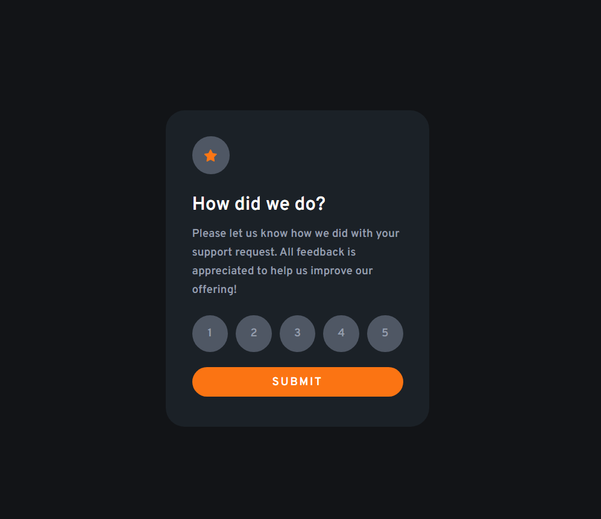

# Frontend Mentor - Interactive rating component solution

This is a solution to the [Interactive rating component challenge on Frontend Mentor](https://www.frontendmentor.io/challenges/interactive-rating-component-koxpeBUmI). Frontend Mentor challenges help you improve your coding skills by building realistic projects. 

## Table of contents

- [Overview](#overview)
  - [The challenge](#the-challenge)
  - [Screenshot](#screenshot)
  - [Links](#links)
- [My process](#my-process)
  - [Built with](#built-with)
  - [What I learned](#what-i-learned)
  - [Continued development](#continued-development)
  - [Useful resources](#useful-resources)
- [Author](#author)

## Overview

### The challenge

Users should be able to:

- View the optimal layout for the app depending on their device's screen size
- See hover states for all interactive elements on the page
- Select and submit a number rating
- See the "Thank you" card state after submitting a rating

### Screenshot



### Links

- Solution URL: [Solution](github.com/Einsteinj04/interactive-rating-component/)
- Live Site URL: [Interactive-rating-component](https://interactive-app.netlify.app)

## My process

### Built with

- Semantic HTML5 markup
- CSS custom properties
- Flexbox
- CSS Grid
- Mobile-first workflow
- Vanilla Javascript

### What I learned

This was my project working with the DOM and interactivity with javascript. It was fun and challenging as I had to do a lot of google searches and watched some youtube tutorial videos.
My greatest challenge though was how to change the homepage contents into the 'thank you' state on clicking submit.
I finally went on to do :
```css
{
  display: none
}
```
to hide elements when clicking the submit button

### Continued development

I would love to learn more about working with the DOM because I see how powerful It can be combining it with JavaScript. Hopeful to build more projects

### Useful resources

-**Google
-**StackOverflow
-**Youtube Videos


## Author
- Twitter - [Chukwuebuka Ukoha](https://www.twitter.com/Uko1Chukwuebuka)
